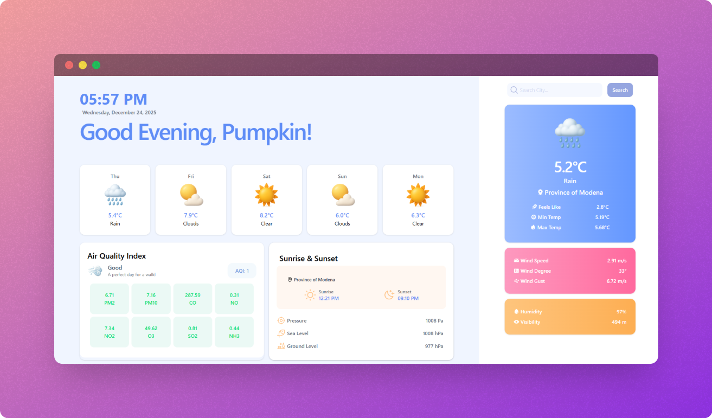

# 🌦️ Weather Dashboard

  

 

A modern, responsive weather dashboard built with **React** that displays real-time weather forecasts, air quality data, and detailed atmospheric information using the **OpenWeather API**.

---

## 🚀 Live Demo

👉 **Live URL:**  
[https://weatherdashboard3.netlify.app/](https://weatherdashboard3.netlify.app/)

---

## ✨ Features

- 🌡️ Current temperature with **feels like**, min & max values  
- 🌧️ Weather condition icons (custom local assets)  
- 🌬️ Wind speed, direction, and gusts  
- 💧 Humidity & visibility cards  
- 🌅 Sunrise & sunset times  
- 🌫️ Air Quality Index (AQI) with pollutant breakdown  
- 📱 Fully responsive (mobile, tablet, desktop)  
- ⏳ Skeleton loaders while fetching data  

---

## 🛠️ Tech Stack

- **React**
- **Vite**
- **Tailwind CSS**
- **OpenWeather API**
- **Phosphor Icons**
- **React Loading Skeleton**
- **Thiings Icons**
 
## 🧾 Notes

- Weather icons are **locally managed assets**, ensuring consistent visuals independent of API icon availability.
- The application follows a **component-driven architecture** with clearly separated concerns.
- Reusable UI components are configured via props for flexibility and scalability.
- Fully responsive layout built with **Tailwind CSS**, optimized for all screen sizes.
- Data is sourced from the **OpenWeather API**, including forecast and air quality endpoints.

---

## ✅ Summary

This Weather Dashboard delivers a clean, responsive interface for visualizing weather conditions, forecasts, and air quality data in real time.  
The project emphasizes maintainability, clarity, and performance while providing a visually engaging user experience.

---

## 🤝 Contributions & Feedback

Contributions, suggestions, and improvements are welcome.  
If you find this project useful, consider giving it a ⭐ to support continued development.

---
 

